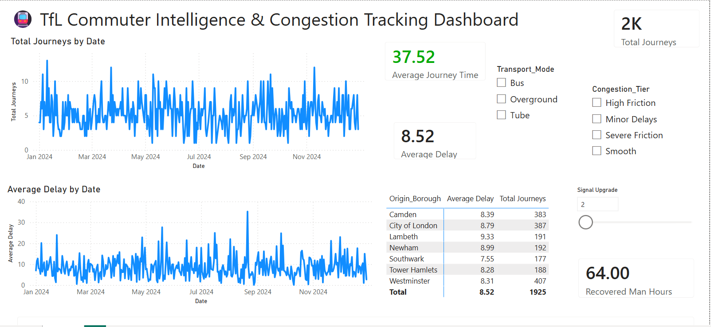
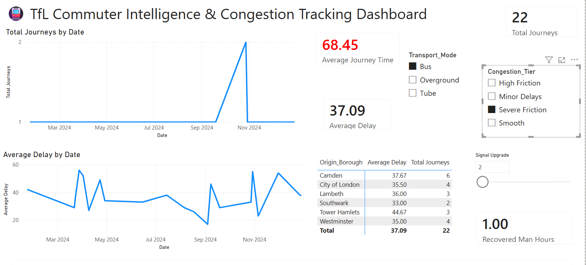
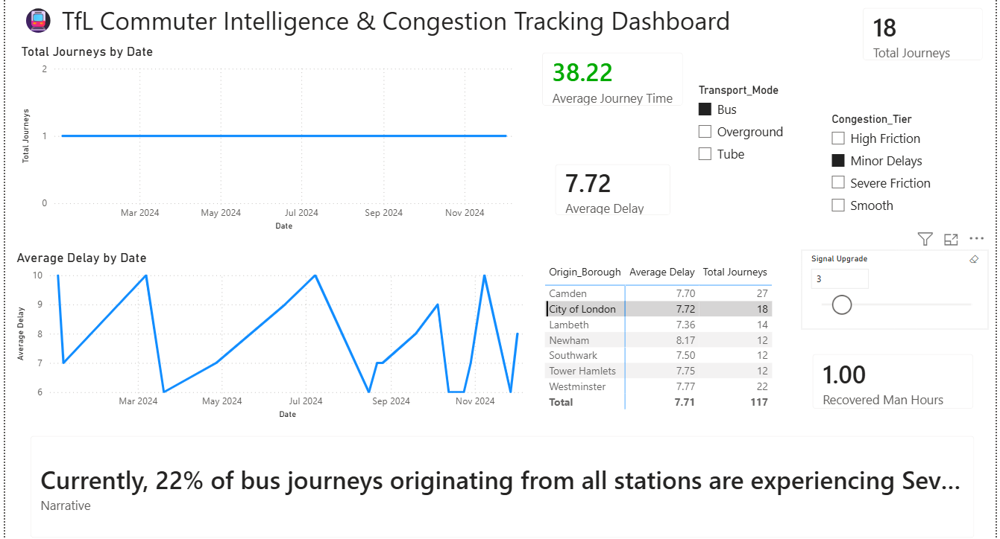
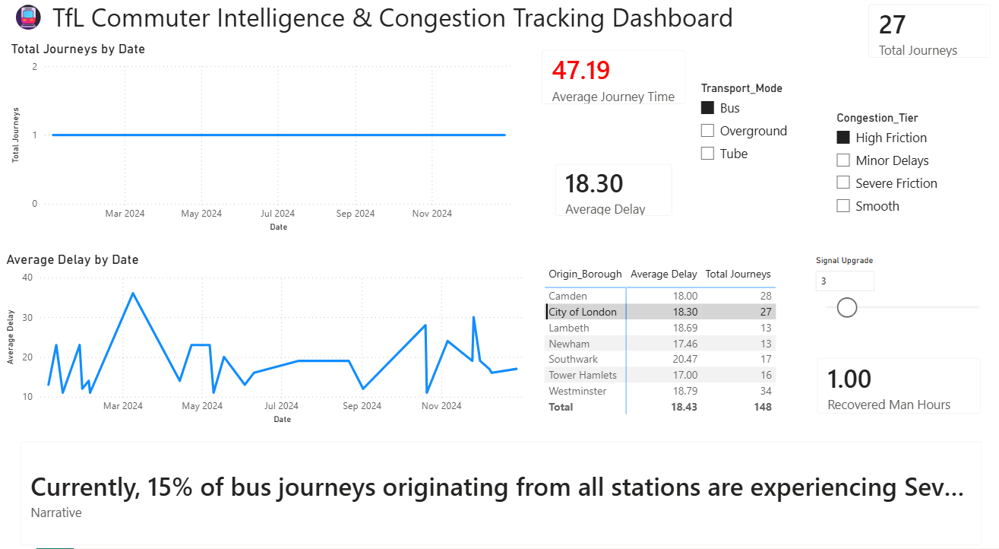
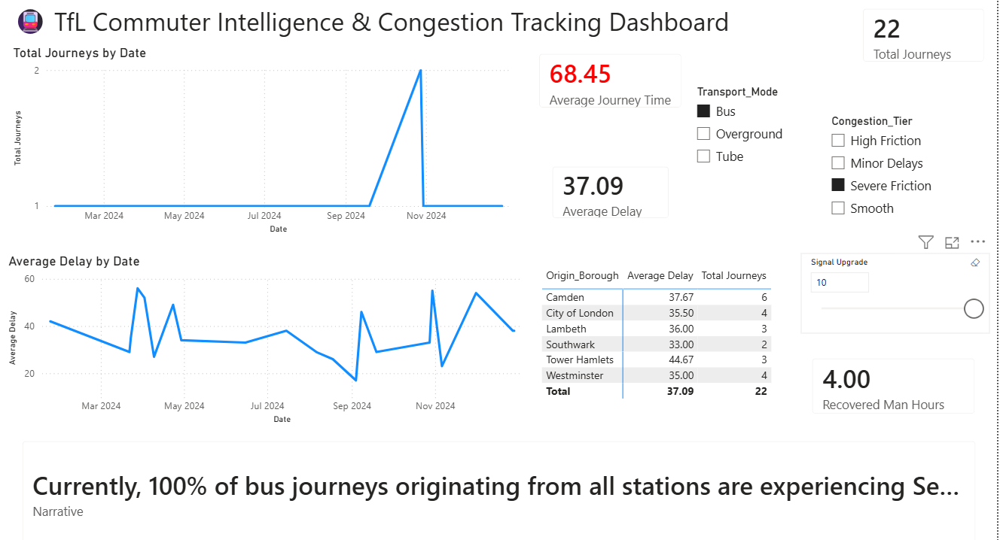

# 🚇 Transport for London (TfL) Commuter Trends & Congestion Tracker

## Project Overview

Transport for London manages millions of commuter journeys every day across Tube, Bus and Overground services. Monitoring congestion, delays and operational inefficiencies is critical for maintaining service quality and improving commuter experience.

This project develops an end-to-end transport analytics solution that transforms raw commuter journey data into actionable business intelligence. Using Python, SQL, MySQL and Power BI, the system identifies abnormal journeys, classifies congestion severity, detects network bottlenecks and provides executive-level insights through an interactive dashboard.

## Business Objectives

The project was designed to answer key operational questions:

- Which stations experience the highest commuter friction?
- Which routes suffer the most severe delays?
- Are commuters being overcharged due to faulty infrastructure?
- How much worse are peak-hour journeys compared to off-peak travel?
- Which London boroughs experience the highest congestion?
- How much commuter time could be recovered through infrastructure improvements?

## Dataset

The analysis uses Transport for London journey records containing:

- Journey ID
- Date
- Transport Mode
- Origin Station
- Destination Station
- Tap-In Time
- Tap-Out Time
- Journey Cost
- Delay Minutes

The dataset simulates commuter behaviour across Tube, Bus and Overground services throughout London.

## Python Data Engineering

An automated ETL pipeline was developed using Pandas and SQLAlchemy.

### Key Deliverables

✔ Data ingestion and validation

✔ Date and time standardisation

✔ Journey duration calculation

✔ Cost-per-minute analysis

✔ Time-of-day classification

✔ Anomaly detection engine

✔ Congestion classification logic

✔ Automated MySQL loading

## Rule-Based Congestion Intelligence Engine

A deterministic expert system was implemented to classify commuter congestion without machine learning.

The logic engine evaluates:

- Delay duration
- Journey duration
- Time of day
- Transport mode

Each journey is automatically classified into:

- Smooth
- Minor Delays
- High Friction
- Severe Friction

This provides fully explainable congestion classifications suitable for operational reporting.

## SQL Operational Analytics

Advanced SQL analysis was performed on the cleaned transport database.

### Chronic Bottleneck Detection

Identified station and transport-mode combinations consistently affected by severe congestion.

### Overcharged Commuter Investigation

Detected journeys where fares significantly exceeded route averages.

### Peak Stress Analysis

Measured performance degradation during rush-hour periods.

### Ghost Tap Audit

Investigated possible failures in station tap-in/tap-out infrastructure.

## Executive Dashboard

The Power BI dashboard enables interactive monitoring of London's transport network.

### Features

- Total Journey Monitoring
- Average Delay Tracking
- Average Journey Time KPI
- Congestion Tier Filtering
- Transport Mode Analysis
- Dynamic Narrative Generation
- KPI Alert Logic
- What-If Scenario Modelling
- Recovered Man-Hours Simulation

## Key Insights Generated

The dashboard allows decision makers to:

- Identify congestion hotspots
- Monitor delay trends over time
- Compare performance across transport modes
- Detect severe friction routes
- Evaluate infrastructure improvement scenarios
- Estimate commuter time savings from signal upgrades

## Dashboard Preview

### Main Dashboard

### Congestion Analysis

### Dynamic Narrative

### KPI Alert Logic

### What-If Analysis

## Technology Stack

| Layer | Technology |
|---------|------------|
| Programming | Python |
| Data Processing | Pandas |
| Database | MySQL |
| Database Access | SQLAlchemy |
| Analytics | SQL |
| Visualisation | Power BI |
| Modelling | DAX |
| ETL | Power Query |

## Repository Structure
...
